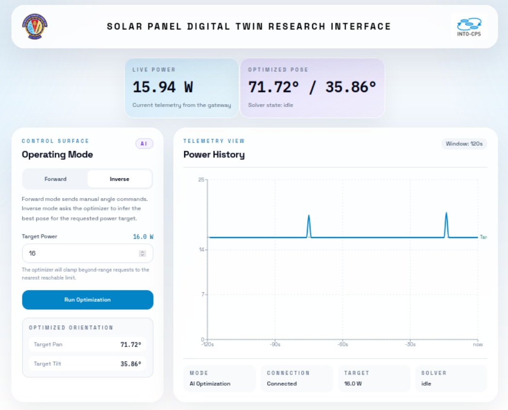

## Solar Panel Digital Twin — README

This repository contains a lightweight digital twin for a two-axis solar tracker
with: a Python-based optimizer, a Node.js gateway bridging to hardware, a
mock TCP hardware simulator, and a React web interface.

This README focuses on the `solar-panel` digital twin: how to run it with the
provided lifecycle scripts, what features are included, architecture details,
and how to replace the mock hardware with a real panel adapter.

Repository layout (relevant paths):

- `lifecycle/` — startup/stop helper scripts (`create`, `execute`, `terminate`).
- `models/optimizer.py` — Python optimizer (MPPT + radial search logic).
- `gateway/` — Node.js Socket.IO server and TCP bridge to hardware.
- `hardware/mock_panel.py` — TCP mock hardware that simulates real panel
  telemetry and accepts pan/tilt commands.
- `frontend/` — React + Vite web UI (control + visualisation).
- `REPLACE_MOCK_WITH_REAL.md` — step-by-step instructions for swapping in a
  real hardware adapter.

High-level features

- Event-driven Python optimizer which supports periodic MPP rechecks,
  time-based settle, and dynamic min/max adaptation for real panels.
- Gateway with configurable transmit/receive latency knobs (useful for
  reproducing real hardware delays).
- A mock hardware implementation that simulates actuator and telemetry delays
  and can be swapped for real hardware via `HARDWARE_SCRIPT`.
- Lifecycle scripts that install dependencies (`create`), start/stop the
  services (`execute` / `terminate`), and write logs and PIDs for clean
  shutdowns.

Operating Modes
----------------

The system supports two mutually-exclusive runtime modes controlled from the
frontend or via Socket.IO events. The gateway advertises the current mode to
clients and enforces behavior accordingly.

- Forward (Manual) Mode:
  - The user directly sets `pan` and `tilt` via the frontend controls or the
    `set_angles` Socket.IO event. The gateway forwards `<pan,tilt>` frames to
    the hardware every second and immediately on each explicit `set_angles`.
  - The optimizer is passive in this mode (its `start_mode` is 0 and it will
    not run the calibration/search state machine).

- Inverse (AI / Optimizer) Mode:
  - The frontend sends an `update_target_power` (or legacy `set_target_power`)
    event containing a numeric `target` in Watts. The gateway switches to
    `inverse` mode and broadcasts the request to connected model clients.
  - The optimizer runs a two-phase algorithm: 2-D Perturb & Observe to find
    the MPP, then a radial binary search along a ray from MPP to a corner to
    reach the requested target power. When the optimizer emits `model_update`
    events with `target_pan` / `target_tilt` the gateway forwards those poses
    to hardware while broadcasting `optimization_result` to clients.

Component Details
-----------------

- Frontend (React / Vite):
  - Files: `frontend/` — UI at [frontend](files/tanaysheth0108/digital_twins/solar-panel/frontend)
  - Connects to the gateway (Socket.IO) and displays live telemetry, a
    rolling power chart, optimizer state, and controls to toggle between
    Forward and Inverse modes. It emits `control_mode`, `set_angles`, and
    `update_target_power` events.

- Gateway (Node.js Socket.IO + TCP bridge):
  - Files: `gateway/server.js` — [gateway/server.js](files/tanaysheth0108/digital_twins/solar-panel/gateway/server.js)
  - Serves Socket.IO on port `4000` and a simple TCP server on port `4001` to
    which hardware (mock or real adapter) connects. It parses `>P:<value>`
    power frames from hardware and forwards telemetry to clients. In
    `inverse` mode it forwards optimizer poses to hardware; in `forward` mode
    it repeats the manual setpoint periodically.
  - Environment knobs: `HARDWARE_TX_DELAY_MS`, `HARDWARE_RX_DELAY_MS` for
    simulating transport latency.

- Mock Panel (TCP simulator):
  - Files: `hardware/mock_panel.py` — [hardware/mock_panel.py](files/tanaysheth0108/digital_twins/solar-panel/hardware/mock_panel.py)
  - Implements a tiny Arduino-like protocol: it accepts `<pan,tilt>` lines
    and immediately replies with `>P:<power>` frames. Delay knobs
    `CMD_RX_APPLY_DELAY_SEC` and `POWER_TX_DELAY_SEC` model actuator and
    telemetry delays.

- Optimizer (`models/optimizer.py`):
  - Files: `models/optimizer.py` — [models/optimizer.py](files/tanaysheth0108/digital_twins/solar-panel/models/optimizer.py)
  - FMU-style Python model (via `pythonfmu`) that implements:
    - Phase 1: 2-D Perturb & Observe (P&O) to locate the MPP (maximum power
      point).
    - Phase 2: Radial binary search along a ray from MPP to a corner to meet
      a requested target power.
  - Runtime knobs: `SETTLE_TIME_SECONDS`, `REPEAT_INTERVAL_CHECK`,
    `MIN_REFRESH_ENABLED`, `MIN_REFRESH_PROBES`. The optimizer is
    event-driven — it advances one `do_step` per telemetry tick and uses a
    settle counter (ticks + optional seconds) after each commanded movement
    to avoid reading stale power values.


Quick Lifecycle (the only commands you need):
-----------------

Make lifecycle scripts executable and run the three standard phases:

```bash
cd /workspace/digital_twins/solar-panel
chmod +x lifecycle/*
./lifecycle/create
./lifecycle/execute
# when finished:
./lifecycle/terminate
```

What the lifecycle scripts do (detailed)

- `./lifecycle/create`
  - Creates and activates a Python virtual environment (`venv`) and installs
    the Python dependencies required to run the optimizer and client code —
    notably `pythonfmu` and `python-socketio` when applicable.
  - Installs Node.js via `nvm`, and runs `npm install` inside `gateway/` and
    `frontend/` to prepare the web UI and gateway.

- `./lifecycle/execute`
  - Starts `gateway/server.js` (Socket.IO + TCP bridge) in background and
    logs output to `logs/gateway.log`.
  - Starts the React development server for the frontend and attempts to
    detect the actual PID listening on port `5173` so that `terminate` can
    reliably stop it (handles `npm` spawn behaviour where children run the
    dev server).
  - Starts `hardware/mock_panel.py` (or the script pointed to by
    `HARDWARE_SCRIPT`) to emulate the panel and actuators.
  - Starts the Python optimizer using `models/optimizer.py`.
  - Writes PIDs to `.run.pids` and logs to `logs/`.

- `./lifecycle/terminate`
  - Reads `.run.pids` and attempts graceful `kill` on each PID, then
    forcibly kills any processes left listening on the known ports (5173,
    4000, 4001) using `lsof` where available.
  - Removes `.run.pids` and performs final cleanup.

How the pieces interact (runtime flow)

1. The frontend connects to the gateway via Socket.IO (default: WS port
   4000). It receives telemetry updates, optimization results and can send
   control commands (setpoints, manual pan/tilt).
2. The gateway accepts frontend commands and forwards actuator commands to
   the hardware bridge (TCP port 4001). It also accepts raw telemetry frames
   from hardware and forwards them to connected clients.
3. The mock hardware listens on the TCP port, accepts simple pan/tilt
   commands, simulates physical response and periodically emits `>P:<power>`
   frames to the gateway.
4. The optimizer listens for telemetry updates and issues pan/tilt commands
   when running in inverse (AI) mode; it implements P&O + radial binary
   search and includes several real-hardware-friendly knobs (settle time,
   periodic rechecks, min-refresh probes).

Important environment knobs and configuration

- `HARDWARE_SCRIPT` — path to the hardware script launched by the lifecycle
  runner (defaults to `hardware/mock_panel.py`). Set this to your real-hardware
  adapter script to swap in a real panel.
- Gateway latency simulation:
  - `HARDWARE_TX_DELAY_MS` — delay in ms applied to writes sent from the
    gateway to hardware (defaults: 0).
  - `HARDWARE_RX_DELAY_MS` — delay in ms applied to telemetry/events sent
    from gateway to the frontend (defaults: 0).
- Optimizer runtime knobs (in `models/optimizer.py`):
  - `SETTLE_TIME_SECONDS` — additional seconds to wait after issuing a
    movement command before sampling power (models actuator travel + comms).
  - `REPEAT_INTERVAL_CHECK` — seconds between full MPP rechecks (0 disables).
  - `MIN_REFRESH_ENABLED` & `MIN_REFRESH_PROBES` — probe low-power corners
    during periodic rechecks to detect changing minimum reachable power.
- Mock hardware delays (in `hardware/mock_panel.py`):
  - `CMD_RX_APPLY_DELAY_SEC` — seconds the mock waits before applying received
    pan/tilt commands (simulates actuator delay).
  - `POWER_TX_DELAY_SEC` — seconds between telemetry power updates (simulates
    sensor/comm sampling rate).

Switching from mock to real panel (summary)

We included documentation and steps in `REPLACE_MOCK_WITH_REAL.md` but the
core method is simple and intentionally low-friction:

1. Implement or obtain a hardware adapter script that exposes the same TCP
   protocol as `hardware/mock_panel.py` (accept pan/tilt commands and emit
   `>P:<power>` frames). Place it somewhere in the `hardware/` folder or
   another path accessible by the lifecycle scripts.
2. Set the `HARDWARE_SCRIPT` environment variable before running
   `./lifecycle/execute`. Example:

```bash
export HARDWARE_SCRIPT=hardware/real_panel_adapter.py
./lifecycle/execute
```

3. Confirm gateway is connecting to the hardware (check `logs/gateway.log`) and
   that the frontend shows telemetry. The gateway's TX/RX delays can be used
   to match the real device latency for more realistic testing.

Notes on protocol compatibility

- The mock uses a very small, plain-text TCP protocol (simple `pan,tilt` write
  and `>P:<power>` telemetry). Implementing the real adapter to follow those
  frames keeps the system compatible without code changes.
- If your real adapter uses a different transport (serial, MQTT), write a
  thin adapter that translates that transport to the TCP framing used here
  and point `HARDWARE_SCRIPT` at it.


Recent additions (summary)
--------------------------

The following changes were introduced during the recent hardening and
feature-addition work:

- Optimizer periodic re-checks: `REPEAT_INTERVAL_CHECK` causes the optimizer
  to re-run P&O calibration and re-solve the target periodically to adapt to
  drifting conditions.
- Settle-time and tick-based settling: `SETTLE_TIME_SECONDS` and internal
  settle ticks prevent oscillation caused by reading stale telemetry after
  moves.
- Dynamic reachable bounds: the optimizer tracks `max_power` and `min_power`
  from observations, clamps targets outside the reachable envelope, and
  reports `achievable` / `clamped` status in `model_update` events.
- Min-bound refresh probes: during periodic rechecks, the optimizer can
  probe low-power corners to update the `min_power` estimate (`MIN_REFRESH_*`).
- Gateway and mock latency knobs: `HARDWARE_TX_DELAY_MS`,
  `HARDWARE_RX_DELAY_MS`, `CMD_RX_APPLY_DELAY_SEC`, `POWER_TX_DELAY_SEC`.
- Hardware swappability: `HARDWARE_SCRIPT` environment variable lets you
  substitute `hardware/mock_panel.py` with a real adapter script without
  modifying lifecycle code.


